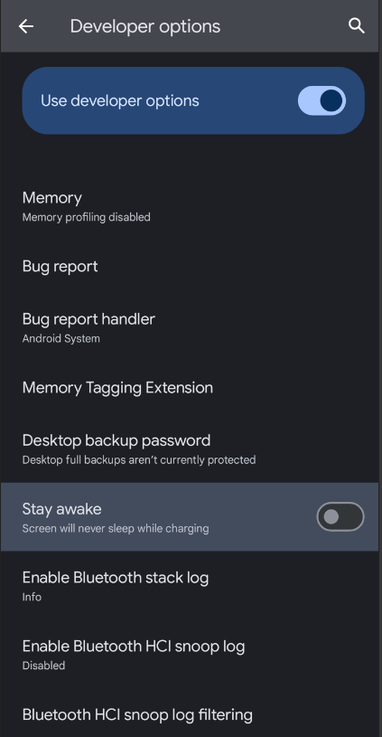
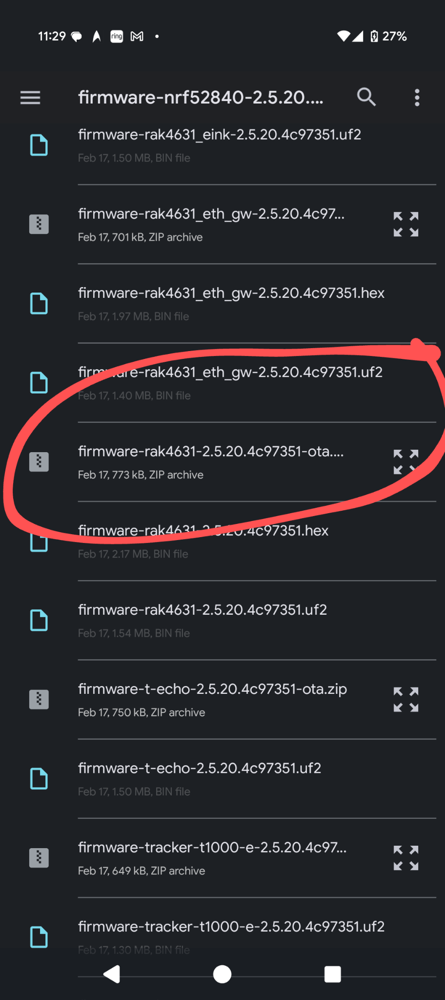
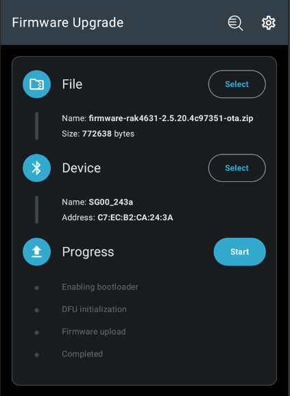

# OTA Meshtastic Updates on Android

It’s simple to push **OTA Meshtastic updates** with Android-based devices. You just need to gather a few things first. Before proceeding, adjust your Android settings:

- Go to **Settings > About Phone**
- Scroll to the bottom and **tap “Build Number” 5 times** to enable Developer Mode
- In **Developer Settings**, enable **Stay Awake** (keeps the phone from sleeping while charging)
- 
---

## Steps to Update

### 1. Download the DFU Utility
Download the **Device Firmware Update Utility** from the Google Play Store:

[DFU Utility on Google Play](https://play.google.com/store/apps/details?id=no.nordicsemi.android.dfu)

---

### 2. Get the Meshtastic Firmware
Download the current Meshtastic firmware release from GitHub:

[Meshtastic Firmware Releases](https://github.com/meshtastic/firmware/releases)

**Important:**
- Choose the **correct MCU firmware** — in this case, **nRF52840**
- **Unzip** the downloaded package

---

### 3. Open the NRF Device App
Launch the **NRF Device App** you just installed.

---

### 4. Select the Firmware
- Tap **Select Firmware**
- Navigate to where you unzipped the **nRF52840 firmware**
- Select the appropriate **zipped OTA package** for your node

**Example:**
For Rak4631 WisBlock nodes, choose:  
`firmware-rak4631-2.7.3cf574c7-ota.zip`

*Tip:* Look for filenames that start with `firmware-rak4631` and end with `-ota.zip`.

---

### 5. Choose the Device
- Tap the **Select** button next to **Device**
- Choose the node you want to update

---

### 6. Start the Update
- Plug your phone in
- Tap **Start** to begin the OTA update process
- 

---

## Warning
If your phone powers off or the transfer is interrupted:
- The device may **soft brick**
- You’ll need to enter **DFU mode** and push the firmware manually using a standard flashing method
