# Getting Started
## Flashing Your Device
Using the [MeshCore Web Flasher](https://flasher.meshcore.io/) is similar to the Meshtastic one if you are already familiar with the process with one exception.

- Connect your device to your computer via USB
- Select your device from the list (MichMesh Node is ProMicro nrf52 (faketec))
- Select your node's role type (see [Node Role Types](./index.md#Node-Role-Types-Dont-be-THAT-person) for an explanation)
- Click the Enter DFU Mode, select your device from the pop-up
- IMPORTANT - Click Erase Flash, select your device from the pop-up. This MUST be done if this is a first time MeshCore flash for the device!
- Click Flash, select your device from the pop-up.

## Setting Up Your Device (Companion)
If your device has a screen, like the Heltec v3/v4 or T114, you will get the bluetooth pin. I suggest paying attention and writing it down because the screen time out on some of these units is quick. If you missed it, simply reset it and it will pop up and give you a new pin. OTHERWISE, the default is 123456.

### Quick Setup by QR (Android) {#quick-setup-by-qr-android}

If you use [MeshCore Hardened](./02-MeshCore-Applications.md#meshcore-hardened), connect your radio in the app and scan this code. It sets the Michigan radio preset (910.525 MHz, 62.5 kHz, SF7, CR 5), 2-byte path hashes, and the Michigan [region](./03-Repeater-Setup.md#regions) tree with `mi` as the [global flood scope](#mch-default-scope). The app shows you the settings and asks before applying anything.

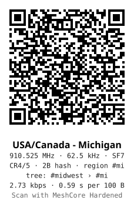

The code carries no transmit power or channel keys, so it's safe to print or post. Once it's applied, pick up the manual steps below at setting your name.

### Manual Setup

- Connect via Bluetooth. IF This is a device you previously paired, you'll first want to "forget" the device in your phone's/computer's bluetooth settings.
- Go to Settings (Cog Icon in Android App)
- Set your Name. Unlike MeshTastic, there is only a "Long Name".
- Set your Lat/Long if your node is stationary. Select "Share Position in Advert" if you would like.
- In Radio Settings, select "Choose Preset". Select USA/Canada (Recommended) if in the US.
- Tap the "Check Mark" in the upper right (if on Android). This applies the current settings.
- Set your region to `mi`. See [Set Your Region](#set-your-region) below.
- Bluetooth Settings - Change it to "Custom" and put in a 6 digit pin. Tap Check mark in upper right (if on Android) then scroll down and reboot. You will need to reconnect to the device (select forget from phone/computers menu first).

:::tip Lost Bluetooth PIN
No need to erase and re-flash. On boards with a user button, hold it down within 8 seconds of boot for CLI Rescue mode, then run `set pin <new_pin>` from the Console on the [web flasher](https://flasher.meshcore.io/).
:::

### Set Your Region {#set-your-region}

Michigan repeaters use [regions](./03-Repeater-Setup.md#regions) to decide how far a message floods. You don't need a repeater of your own to set this up; every companion should.

Region scopes on a companion need firmware 1.15 or later. Screenshots here were taken with firmware 1.17.1. The setup is the same in either app:

- **Set a default scope of `mi`** (required). Adverts, direct messages, logins, and every channel without its own scope go out scoped to Michigan.
- **Scope individual channels narrower** (optional), for example `#grr` to `grr`.

Discovering regions from repeaters only fills in the app's list of region names, so you can pick them instead of typing them. It doesn't change anything on the radio, and repeaters only answer it from radios that hear them directly. Each repeater answers at most 4 requests every 3 minutes, so if one doesn't reply, wait and try again.

#### MeshCore App {#companion-meshcore-app}

Needs app 1.43 or later. Screenshots are from Android app 1.50.

##### Set the Default Scope {#meshcore-app-default-scope}

1. Open **Settings** (the gear), scroll to **Network Settings**, and tap **Default Region Scope**. App 1.43 had this under **Settings → Experimental Settings** instead.

   

   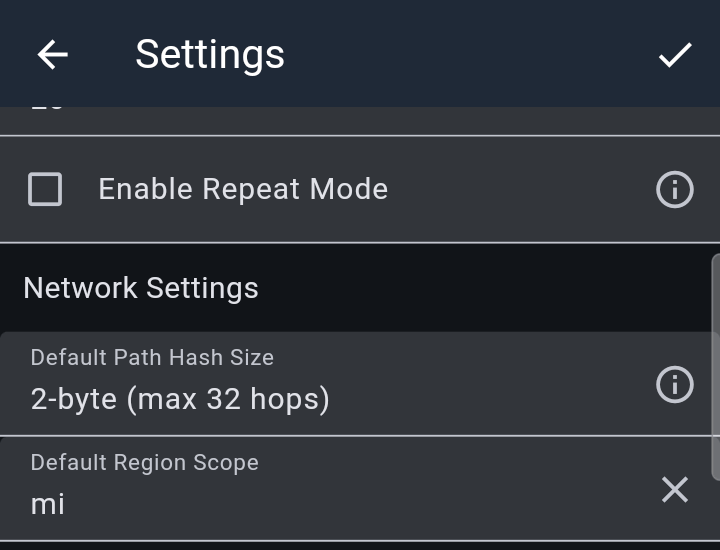

   

2. If the region list is empty, tap **⋮ → Discover Regions**, then tap the **Discover Regions** button, and tap **Add** next to each region you want in your list.

   

   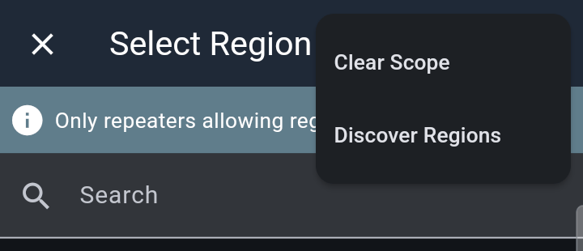

   

   

   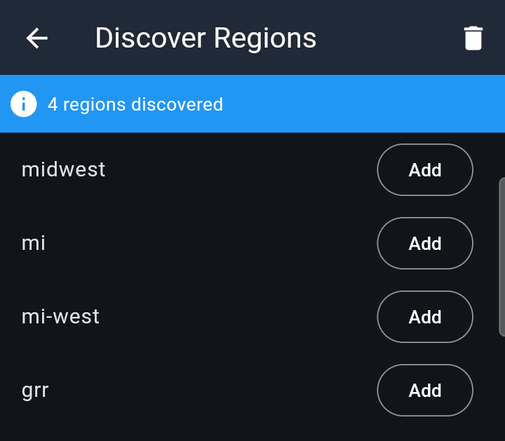

   

   You can also add a region by hand with **+**.

3. Back on **Select Region**, pick `mi`, then tap the **✓** at the top of **Settings** to save it to the radio. Nothing in Settings is saved until you tap **✓**. Once saved, `mi` is marked **default** in the region list.

   

   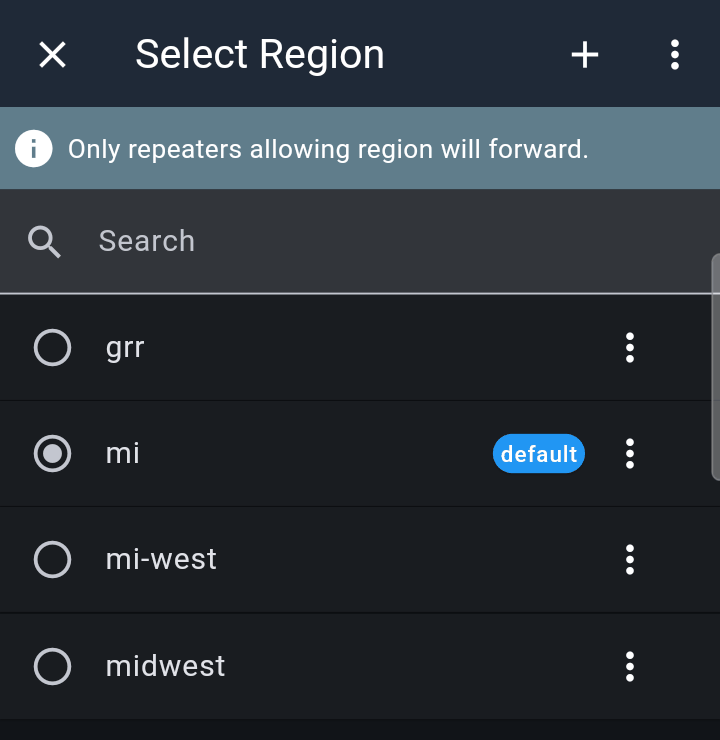

   

The default scope covers adverts, direct messages, logins, and every channel that doesn't have its own scope, so a companion with it set isn't affected by the [unscoped cap](./03-Repeater-Setup.md#flood-max-unscoped).

##### Scope a Channel {#meshcore-app-channel-scope}

A channel with no scope of its own uses the default. Its header shows **↳ Region: mi**, where the arrow means it's inherited:

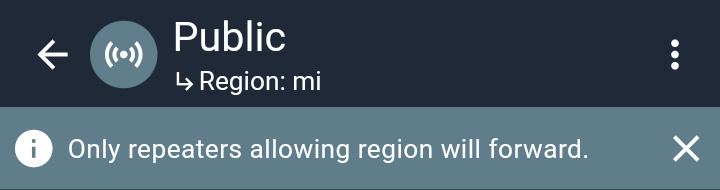

To narrow a channel, open it, tap **⋮ → Set Region Scope**, and pick a region. A channel's scope overrides the default, so only set one where you want less than `mi`. **⋮ → Clear Scope** on the same screen puts the channel back on the default.

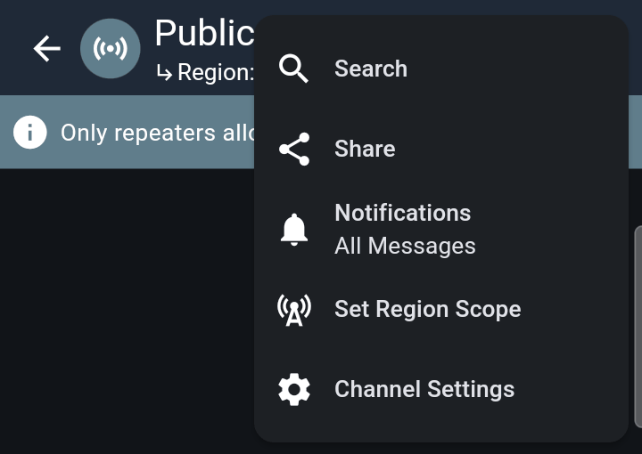

#### MeshCore Hardened {#companion-mch}

Needs [MeshCore Hardened](./02-MeshCore-Applications.md#meshcore-hardened) 0.10.11 or later, which saves the scope on the radio. Earlier versions only kept it until the radio rebooted, so update first. Screenshots are from 0.10.11.

##### Set the Default Scope {#mch-default-scope}

1. Open **Settings** and tap **Mesh policies**.

   

   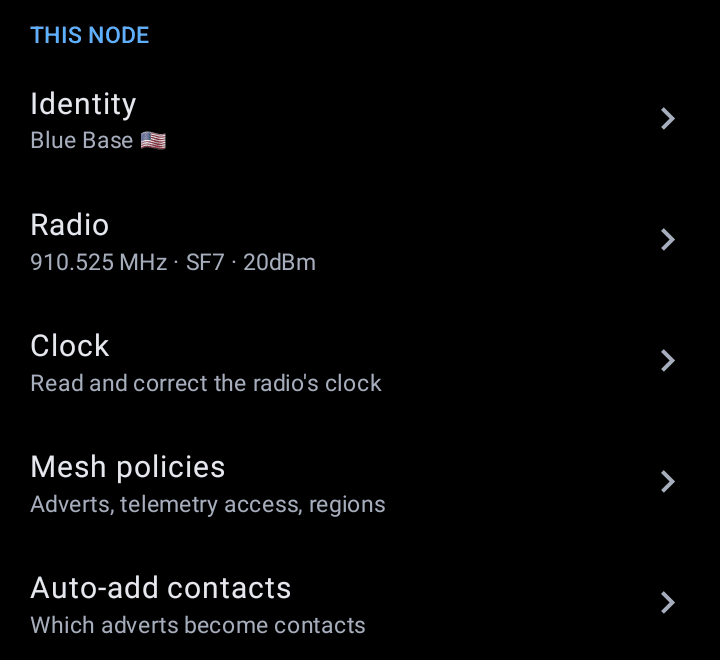

   

2. Under **Regions**, tap **Discover from repeaters…**, then **Add** each region you want and tap **Done**. You can also type a region name and tap **Add**.

   

   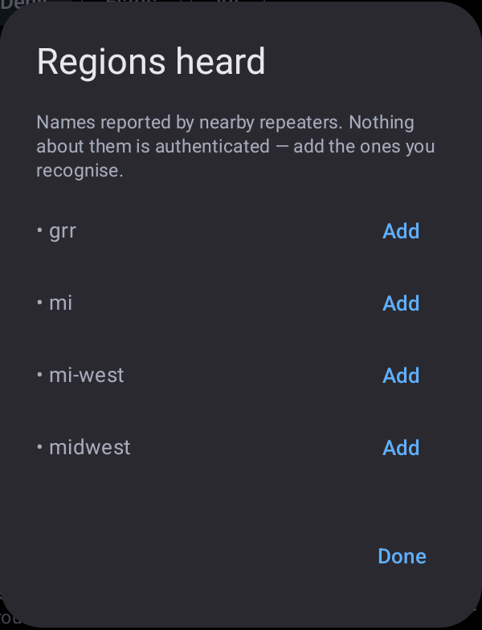

   

3. Under **Global flood scope**, type `mi` and tap **Set**; there's no separate save. The line above the field reads **The radio's saved default scope is region mi** once it's saved. MCH reads this from the radio each time it connects, so it also shows a default set by another app.

   

   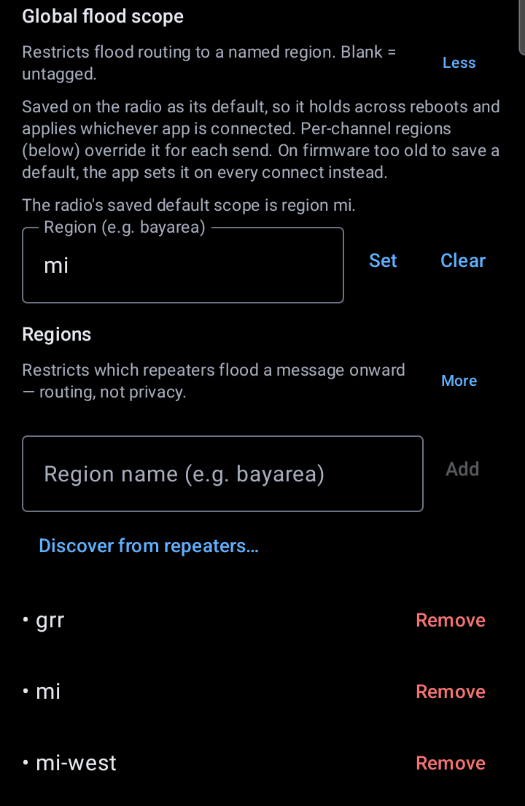

   

**Clear** removes the saved default, and the radio then sends untagged traffic. Don't clear it unless you mean to.

##### Scope a Channel {#mch-channel-scope}

Open the channel, tap **⋮ → Channel settings…**, pick a region under **Region (flood scope)**, and tap **Save**.

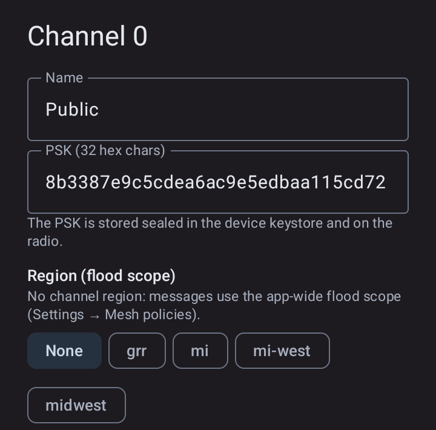

**None** means the channel has no region of its own and uses the **Global flood scope** (`mi`), the same as a channel with no scope in the MeshCore app. Leave it on **None** unless you want the channel narrower than `mi`.

#### Channel Scopes {#companion-channel-scopes}

Channel scopes are separate from the channel name: naming a channel `#grr` doesn't scope it. A practical setup:

| Channel | Scope |
| --- | --- |
| `#michigan` | `mi` |
| `#wmi` | `mi-west` |
| `#grr` / `#azo` | `grr` / `azo` |
| Public | your local region for everyday conversation |

Scope narrowly: use the smallest region the conversation needs. A scoped message only travels through repeaters that carry that region, so a channel scoped to `grr` won't get far once you leave Grand Rapids. When you travel, switch local channels back to the default.

From here, it depends on your personal preference and if you have any sensors attached.

### Sensors

On boards with sensor support built in, the firmware auto-detects common I2C parts: BME280 and BMP280, the AHT and SHT temperature and humidity families, LPS22HB, and the INA power monitors. Wire one up to VCC, GND, SDA and SCL and it shows up on its own.

### GPS

GPS ships disabled. Turn it on under Position settings, tap that sub-menu's "Check Mark" in the upper right, then leave the submenu and select the "Check Mark" in the upper right in the main settings menu.
