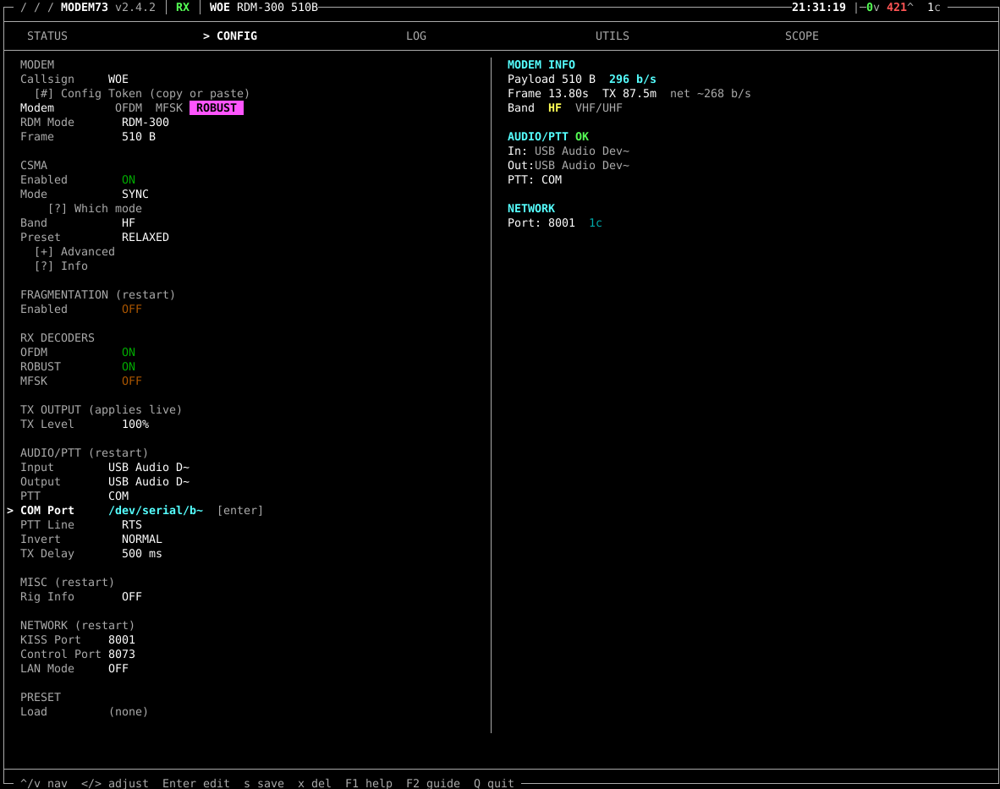
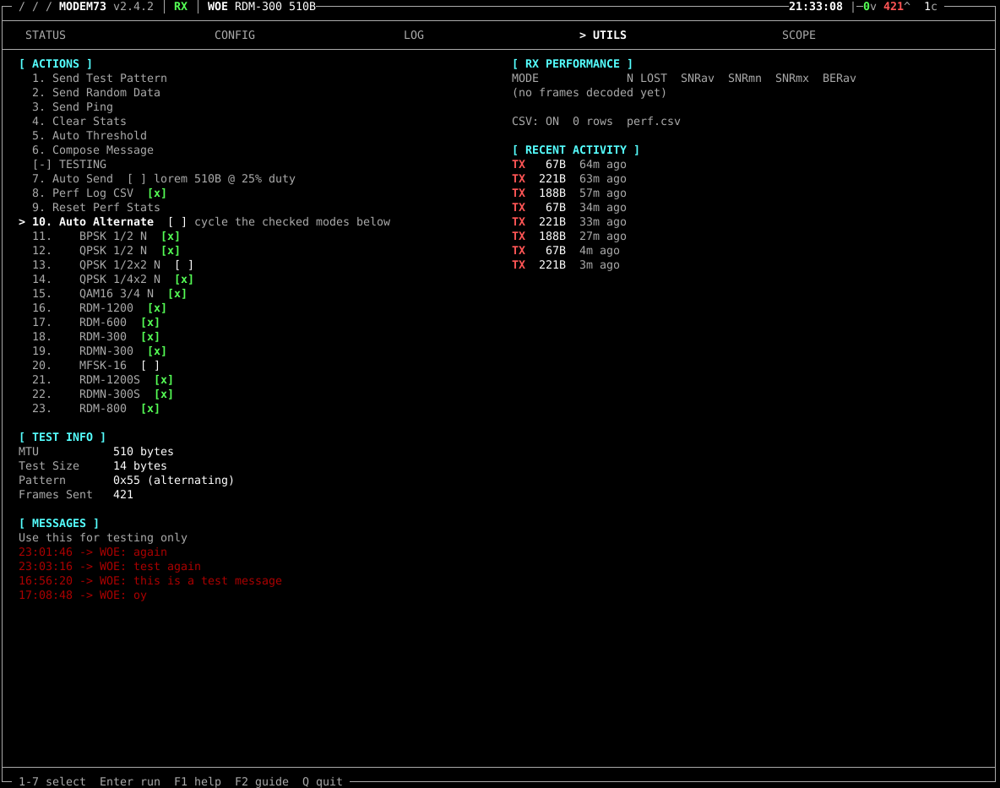
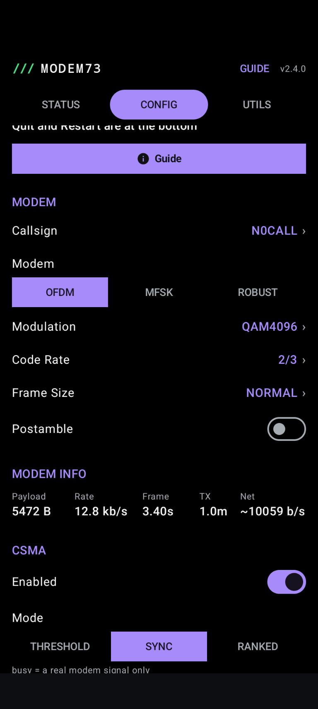
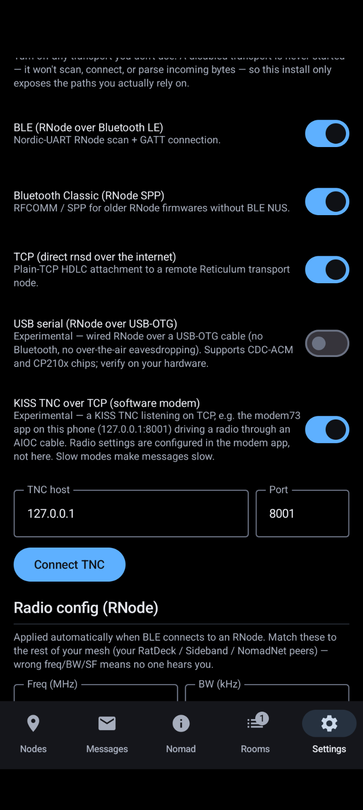

# This is still in beta and not fully rolled out. 
If you're interested in experimenting, feel free to build a node and help make the docs better!

## How to setup Modem73 on Debian.
This assumes that you have already have a running RNS instance with config under `~/.reticulum/`.
1. Fetch and install the latest release of Modem73 for your platform from [github](https://github.com/RFnexus/modem73/releases)
2. Fetch and install the latest release of Modem73interface from [github](https://github.com/RFnexus/modem73interface/) and save it under `~/.reticulum/interfaces/`. 
3. Edit `~/.reticulum/config/` and add the following lines to the `[interfaces]` section. 
```
  [[MODEM73]]
    mode = internal
    type = Modem73Interface
    enabled = yes
    target_host = 127.0.0.1
    target_port = 8001
    control_host = 127.0.0.1
    control_port = 8073

```
4. If you have `enable_transport = True` set, check your other interface modes to sure they are setup in a way you wont flood the modem73 interface. If you just want to get it done, set your TCP interfaces to `mode = boundary` and your internal interfaces to `mode = internal`. If you want to experiment with other modes, give the [announce simulator](https://rns.moscow/announce-sim.html) a try.
5. Start modem73 in a terminal. The following is the minimal config.
- Click on `CONFIG`. 

- Change callsign to something to distinguish yourself while testing. Once you are running you can use N0CALL.
- Pick your mode. For HF we are using either `ROBUST` `RDM300` or `RDM700`. For UHF/VHF we are using `QAM4096` `2/3`. 
- Enable CSMA, `MODE` should be `SYNC`. `PRESET` should be `RELAXED`.
- RX Decoders - it will decode any mode that is not disabled. Setting the above only changes what it transmits. Disable the MFSK decoder - it will give a lot of false positives in your logs/`UTILS` page.
- Setup your audio interface and PTT. For me it is either the digirig `USB AUDIO DEVICE`  or the `AIOC` device for input and output.
- PTT for [DigiRig](https://digirig.net/) and [AIOC](https://na6d.com/products/aioc-ham-radio-all-in-one-cable) use `PTT`:`COM`, select the device to use under `COM PORT`, `PTT LINE` is `RTS`, `NORMAL` or `NOT INVERTED`. Stock `TX DELAY` of 500ms has worked for my radios. 
- Click `QUIT` to save, then restart. Setup another radio with the above or get a buddy to connect with on frequency - both of you should go to the `UTILS` page of `Modem73` and send some test messages, either `1. Send Test Pattern`, or `8. Compose Message`. If you're unsure of what modes will work for you, go to `TESTING` and select the modes you want to test using `Auto-Alternate`. It will cycle through the selected modes and show decodes on the other side under `[ RX PERFORMANCE ]`. For RNS use, you will want any mode that is around 300 bps or faster. 500 bps or faster if you want to account for retransmissions caused by static crashes or other noise. Below that and you will have to go into the apps code and make timeout changes. 

- Once you are happy with your modem settings, you are now ready to flip the switch on RNS!
6. Restart RNS to pick up the changes. If using our prev docs, use `sudo systemctl restart rnsd`
7. Send an announce! Does your other test radio or buddy on the other side see your announce? If so, Victory! If not, hit me (yNos) up on Signal or Discord so we can troubleshoot and fix these docs!


## How to setup Modem73 on android using `ThatSFguy`'s [Reticulum-Mobile-app](https://github.com/thatSFguy/reticulum-mobile-app/) via Obtainium (step 1)
With the little bit of testing I've done so far, the [AIOC - All In One Cable](https://na6d.com/products/aioc-ham-radio-all-in-one-cable) and [DigiRig](https://digirig.net/) are the only interfaces I've gotten to work. 
1. Install [obtainium](https://obtainium.imranr.dev/).
2. Open Obtainium 
3. Click `+ Add` in the bottom right. *Warning*: the first time you install using Obtainium, it will ask you if you want to enable this software source. Click `Yes`/`OK` or toggle the switch that allows this source.
4. To install the Reticulum app, paste `https://github.com/thatSFguy/reticulum-mobile-app/` into the app source URL. Click `+` next to the text entry box. on the next screen, click install. Click `INSTALL` again if prompted.
5. To install Modem73, paste `https://github.com/RFnexus/modem73-android` into the app source URL. Click `+` next to the text entry box. on the next screen, click install. Click `INSTALL` again if prompted.
6. Plug in your `AIOC` before opening Modem73
7. Open Modem73. Use Follow Debian Setup section 4.

8. Open `Reticulum`, go to `Settings`, `Transports`, and toggle `KISS TNC over TCP`.  If you havent changed the network options in Modme73, you should be fine with all the defaults.

9. Send an announce! Does your other test radio or buddy on the other side see your announce? If so, Victory! If not, hit me (yNos) up on Signal or Discord so we can troubleshoot and fix these docs!


