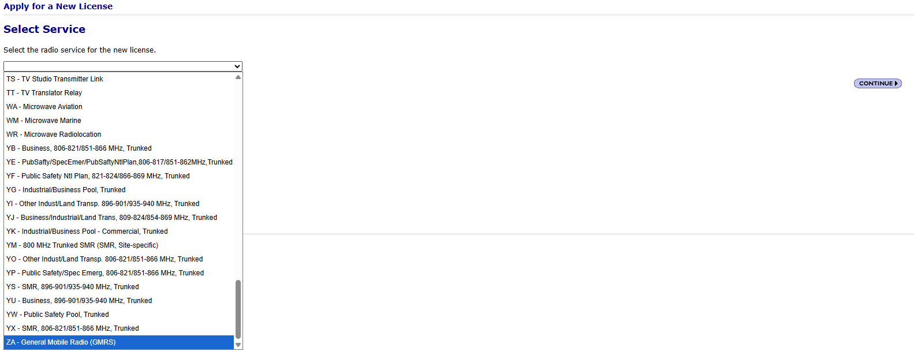
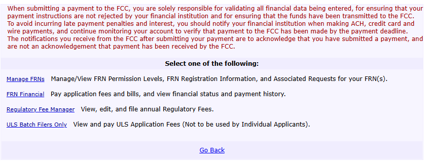
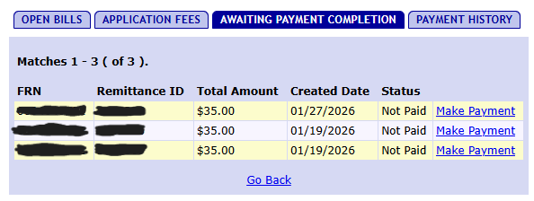

# Who wants to play a game? - FCC Edition
We all know the Unites States federal government and the ABC clubs are about as efficient as car with 3 flat tires, so naturally, the process to get your license CAN be an aggravating keyboard smashing extravaganza. Thats where this little guide comes into play. There ARE several guides out there, unfortunately, they are outdated, specifically when it comes to the payment portion.

So lets get started!
# !!!IMPORTANT NOTE!!!
The FCC pages that are part of this process, at times, can be VERY slow. Like 1996 AOL dial-up slow. Just be patient. Dont click the back arrow on your browser or start clicking random things. You will only upset the FCC gods.

## Step 1 - Registration with the FCC overlords! (Part 1)
Remember when I mentioned the inefficiencies of our ABC clubs? It wasn't a joke. During this process, it will require registering with the FCC twice, using two different sites of theirs. NOW, IF you already have your HAM license, or any other license with the FCC, you can skip this part. You'll need to first visit this site [FCC - Commission Registration System (CORES)](https://apps.fcc.gov/cores/userLogin.do) and click register. Go through that process, and eventually you end up with a 10-digit FRN number. You will need that so write it down or copy it into notepad for the next step.

## Step 2 - Registration with the FCC overlords! (Part 2)
You will now use that 10-digit FRN number you got, and the password you used to log into the FCC Cores system (from step 1) and log-in with the FCC a second time, at a completely different FCC website. How fun and efficient! So visit [FCC - License Manager](https://wireless2.fcc.gov/UlsEntry/licManager/login.jsp) and get yourself logged in.

## Step 3 - Apply for a New License
As the step implies, you will now be applying for the actual license. On the left side menu bar, at the top, you will see a link "Apply for a New License". You will click that and begin the process. The first page has a single drop down menu. You will scroll down all the way to the bottom and select "ZA - General Mobile Radio (GMRS)" and then click continue. Again, some pages load slowly so be patient. Click once, wait to load.

---

The next screen is the Request Type and Fee Status. MOST folks will select NO to all three. Make the selections that apply to you, then click continue.

---

The next screen is for the "Licensee Name and Address". The "Attention To", "P.O. Box", and "Fax" do not need to be filled out. Everything else does. Once you are done, click continue.

---

The next screen is the Basic Qualification Information. There is only one question, and you must answer this truthfully. Being a convict does not necessarily prevent you from receiving a GMRS license, but the form asks you to explain the circumstances of your conviction. If you are, unfortunately I am not sure of the extra steps needed or where to attach the explanation. Once you answer, click continue.

---

The next screen is the summary screen. Look it over carefully, make sure it is filled out correctly, and most importantly, DO NOT use the back button on your browser. Make sure to use the "Edit" buttons or once again you will upset the FCC gods. Click "Continue to Certify" when you are ready.

---

This next screen is your certification screen. Read it, make you sure agree, and then type in your name as provided in the "Licensee Name and Address" step. Title is not necessary. Once ready, click "Submit Application".

---

The last page for this step is the Confirmation. This is where government reliability and efficiency truly shines in all its glory. You need to click the "Continue to CORES for Payment Completion" button. Now one of two things are going to happen. You will either make it back to the login screen step 1, where you will use the USERNAME (NOT FRN) and password you used to create your CORES account, OR you will make it to the infamous "403 Forbidden - The System Could Be busy..." page. Fear not future GMRSer... not all is lost. Simply go to [FCC - Commission Registration System (CORES)](https://apps.fcc.gov/cores/userLogin.do) and log in as explained (username not FRN and password), complete the 2-factor login and you will make it to the main menu for CORES.

---

## Step 4 - Do you Feel Lucky? (Pay Up)
From the main CORES menu, you will select "Manage Existing FRN | FRN Financial | Bills and Fees" which will take you to the menu below.

---

You will then select "FRN Financial" which will take you to the page shown below.

---

You will then select "View/Make Payments" and that will take you to the screen below. You should only see ONE request for payment for $35. This example shows three because that's what happens when their system goes bonkers and there aren't clear instructions on how to deal with their 1995 website when it gets upset so you think you have to redo the application. Click make payment, follow the steps, and you're all done.

---

NOW, many write ups I've come across have said either the call sign is provided instantly or within hours. This is NOT the case. It takes 2-5 business days, depending on how long it takes the payment to clear. Once your call sign has been assigned, it will show up on the main page once you log into the  [FCC - License Manager](https://wireless2.fcc.gov/UlsEntry/licManager/login.jsp). Again, this website is VERY slow at times, to just give it time to load. Below is an example of what you will see when your call sign is assigned.

